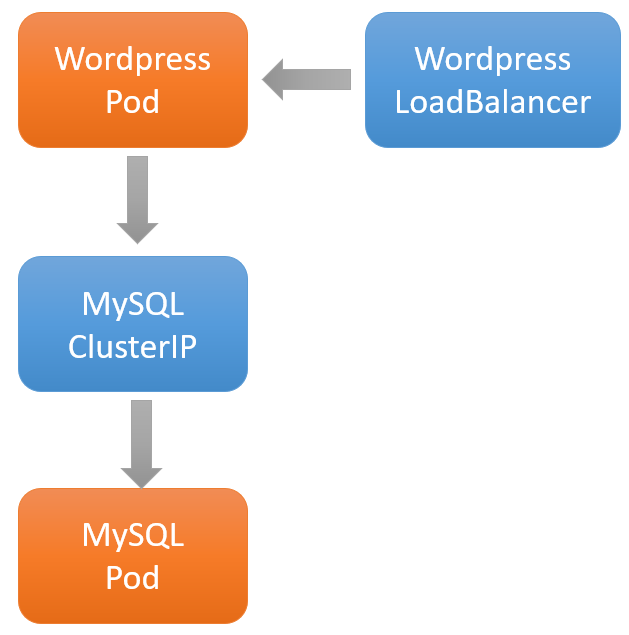
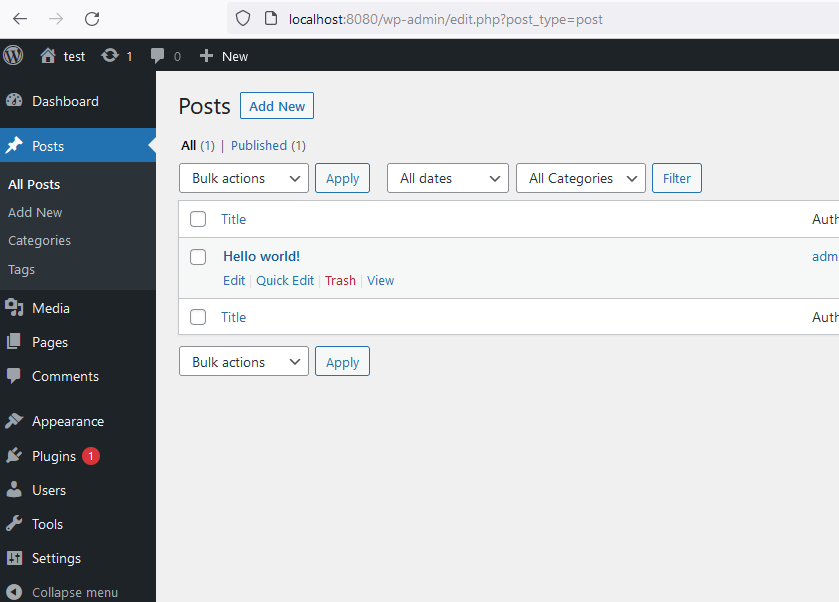

# Introducción

En las siguientes semanas voy a publicar una serie de post sobre cómo ejecutar wordpress en Kubernetes paso a paso, mayormente para comprender los principales elementos de Kubernetes y cómo interactúan.

En esta primera publicación vamos a hacer una aproximación bien simple.


# Convertir Wordpress desde docker-compose a Kubernetes

A modo de ejercicio y para asentar conocimientos la idea es, a partir de un docker-compose, generar los yaml para desplegar Wordpress en Kubernetes.
Lo iremos haciendo paso a paso, desde el enfoque más simple y llegar a un buen nivel de complejidad para cubrir gran parte de los conceptos de Kubernetes.

## docker-compose actual
Este docker-compose es el que aparece en [Docker hub de Wordpress](https://hub.docker.com/_/wordpress) y lo usaremos como base.

``` yaml
version: '3.1'

services:

  wordpress:
    image: wordpress
    restart: always
    ports:
      - 8080:80
    environment:
      WORDPRESS_DB_HOST: db
      WORDPRESS_DB_USER: exampleuser
      WORDPRESS_DB_PASSWORD: examplepass
      WORDPRESS_DB_NAME: exampledb
    volumes:
      - wordpress:/var/www/html

  db:
    image: mysql:5.7
    restart: always
    environment:
      MYSQL_DATABASE: exampledb
      MYSQL_USER: exampleuser
      MYSQL_PASSWORD: examplepass
      MYSQL_RANDOM_ROOT_PASSWORD: '1'
    volumes:
      - db:/var/lib/mysql

volumes:
  wordpress:
  db:
```

Tiene dos servicios, Wordpress y MySQL, un par de volúmenes, uno para la base de datos y otro para los html de Wordpress, unas variables de entorno y algunos secrets (passwords)

## Primer approach

Vamos a crear la versión más simple, para ello vamos a necesitar lo mínimo para que esto funcione en Kubernetes:

- Dos deployments:
  - Worpress: for wordpress app
  - MySQL: for mysql app
- Dos service:
  - CluterIP: para exponer MySQL dentro del cluster y que Wordpress lo puede alcanzar
  - Loadbalancer: para exponer Wordpress al mundo exterior y poder usarlo.

De momento no vamos a poner storage externo, ni configuraciones ni nada.



### Deployment de wordpress

Lo único particular es que le pasamos las variables de entorno y el host de MySQL es **mysql** y el label **app=my-wordpress**

``` yaml
apiVersion: apps/v1
kind: Deployment
metadata:
  name: my-wordpress
  labels:
    app: my-wordpress
spec:
  replicas: 1
  selector:
    matchLabels:
      app: my-wordpress
  template:
    metadata:
      labels:
        app: my-wordpress
    spec:
      containers:
      - name: my-wordpress
        image: wordpress:latest
        ports:
        - containerPort: 80
        env:
        - name: WORDPRESS_DB_PASSWORD
          value: "my-secret-pw"
        - name: WORDPRESS_DB_USER
          value: "my-user"
        - name: WORDPRESS_DB_NAME
          value: "my-db"
        - name: WORDPRESS_DB_HOST
          value: "mysql"
```          

### Deployment MySQL

Similar a Wordpress, un deployment, le pasamos las variables de entorno y en este caso el label **app=my-db**

``` yaml
apiVersion: apps/v1
kind: Deployment
metadata:
  name: my-db
  labels:
    app: my-db
spec:
  replicas: 1
  selector:
    matchLabels:
      app: my-db
  template:
    metadata:
      labels:
        app: my-db
    spec:
      containers:
      - name: my-db
        image: mysql:5.7
        ports:
        - containerPort: 80
        env:
        - name: MYSQL_ROOT_PASSWORD
          value: "my-secret-pw"
        - name: MYSQL_DATABASE
          value: "my-db"
        - name: MYSQL_USER
          value: "my-user"
        - name: MYSQL_PASSWORD
          value: "my-secret-pw"
```          

### Servicios
Tenemos Wordpress y MySQL funcionando, pero necesitamos crear dos servicios como ya dijimos
Uno para que Wordpress puede alcanzar a MySQL (un ClusterIP porque sería un ciente interno del cluster)
Y otro para acceder a Wordpress desde el exterior, un LoadBalancer.

``` yaml
apiVersion: v1
kind: Service
metadata:
  name: mysql ## DNS name (cluster internal)
  labels:
    app: my-db
spec:
  type: ClusterIP
  selector:
    app: my-db # busca el deployment que tenga esa label
  ports: # puertos que va a escuchar
  - name: http
    port: 3306
    targetPort: 3306
  - name: mysql
    port: 33060
    targetPort: 33060
```

Con este ClusterIP ya podemos utilizar un port-forward para probar Wordpress

``` powershell
kubectl port-forward deployment/my-wordpress 8080:80
```



Con portforward funciona, vamos a crear el LoadBalancer

``` yaml
apiVersion: v1
kind: Service
metadata:
 name: wordpress-loadbalancer
spec:
 type: LoadBalancer
 selector:
    app: my-wordpress # Busca a partir del laberl app: my-wordpres
 ports:
  - name: "80"
    port: 8080
    targetPort: 80
```

Y listo, con esto tenemos Wordpress en el puerto 8080 conectado a MySQL

Nos leemos la próxima para mejorar la persistencia
