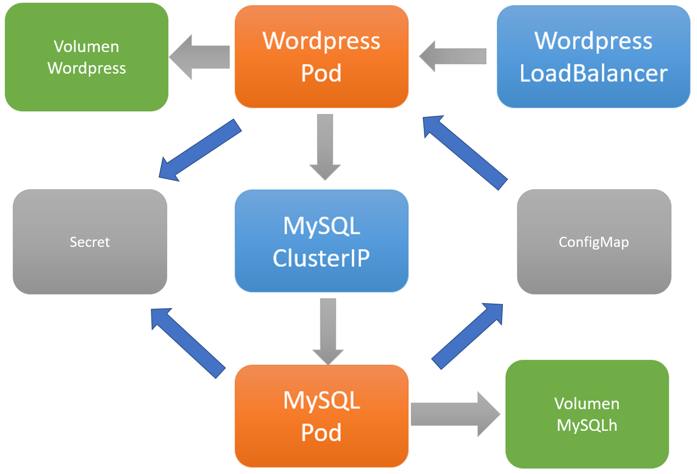

En el [post anterior](/wordpress-kubernetes2) Agregamos Persisten Volumens y Persisten Volume Claims para tener un persistencia más allá del ciclo de vida de los Pods, en este Post vamos a mover la configuración a ConfigMaps y Secrets.



## Crear config maps
El siguiente paso es pasar las environment variables a configuración, de modo de poder modificarlas y que sea escalable.
De momento no vamos a crear secrets, solo pasar los valores a un configmap

Primero creamos el configmap, de momento con los secrets y el mismo para ambas aplicaciones

``` yaml
apiVersion: v1
kind: ConfigMap
metadata:
  labels:
    app: my-wordpress
  name: mywordpress-config
data:
  MYSQL_RANDOM_ROOT_PASSWORD: '1'
  MYSQL_DATABASE: password 
  MYSQL_USER: readWrite
  MYSQL_PASSWORD: password
  MYSQL_HOST: mysql
```

Y modificamos los deployment para cargar sus valores en las variables de entorno

``` yaml
apiVersion: apps/v1
kind: Deployment
metadata:
  name: my-db
  labels:
    app: my-db
spec:
  replicas: 1
  selector:
    matchLabels:
      app: my-db
  template:
    metadata:
      labels:
        app: my-db
    spec:
      containers:
      - name: my-db
        image: mysql:5.7
        ports:
        - containerPort: 80
        volumeMounts:
        - mountPath: /var/lib/mysql
          name: my-db-pv
        env:
        - name: MYSQL_RANDOM_ROOT_PASSWORD
          valueFrom:
            configMapKeyRef:
              name: mywordpress-config
              key: MYSQL_RANDOM_ROOT_PASSWORD
        - name: MYSQL_DATABASE
          valueFrom:
            configMapKeyRef:
              name: mywordpress-config
              key: MYSQL_DATABASE
        - name: MYSQL_USER
          valueFrom:
            configMapKeyRef:
              name: mywordpress-config
              key: MYSQL_USER
        - name: MYSQL_PASSWORD
          valueFrom:
            configMapKeyRef:
              name: mywordpress-config
              key: MYSQL_PASSWORD
      volumes:
      - name: my-db-pv
        persistentVolumeClaim:
          claimName: mysql-pvc
```

``` yaml
apiVersion: apps/v1
kind: Deployment
metadata:
  name: my-wordpress
  labels:
    app: my-wordpress
spec:
  replicas: 1
  selector:
    matchLabels:
      app: my-wordpress
  template:
    metadata:
      labels:
        app: my-wordpress
    spec:
      containers:
      - name: my-wordpress
        image: wordpress:latest
        volumeMounts:
        - name: my-wp-pv
          mountPath: /var/www/html
        ports:
        - containerPort: 80
        env:
        - name: WORDPRESS_DB_PASSWORD
          valueFrom:
            configMapKeyRef:
              name: mywordpress-config
              key: MYSQL_PASSWORD
        - name: WORDPRESS_DB_USER
          valueFrom:
            configMapKeyRef:
              name: mywordpress-config
              key: MYSQL_USER
        - name: WORDPRESS_DB_NAME
          valueFrom:
            configMapKeyRef:
              name: mywordpress-config
              key: MYSQL_DATABASE
        - name: WORDPRESS_DB_HOST
          valueFrom:
            configMapKeyRef:
              name: mywordpress-config
              key: MYSQL_HOST
      volumes:
      - name: my-wp-pv
        persistentVolumeClaim:
          claimName: mywordpress-pvc
```

## Proteger secrets

Los secrets o passwords de la base de datos en el yaml del config map no son una buena idea, podemos hacer dos cosas:
- Crear dos objetos secret en yaml
- Crear los secrets por línea de comandos

Cada uno tiene sus ventajas y desventajas.

Crear dos objectos secret
Ya que los secrets se guardan en base64 primero hay que encodearlos

``` yaml
apiVersion: v1
kind: Secret
metadata:
  name: mysecrets
type: Opaque
data:
  MYSQL_PASSWORD: bXlwYXNzd29yZA==
```

Modificamos el configmap para quitar el password y modificamos los deployments para leer el secret

``` yaml
apiVersion: v1
kind: ConfigMap
metadata:
  labels:
    app: my-wordpress
  name: mywordpress-config
data:
  MYSQL_DATABASE: password 
  MYSQL_USER: readWrite
  MYSQL_HOST: mysql
  MYSQL_RANDOM_ROOT_PASSWORD: '1'
```

``` yaml
apiVersion: apps/v1
kind: Deployment
metadata:
  name: my-db
  labels:
    app: my-db
spec:
  replicas: 1
  selector:
    matchLabels:
      app: my-db
  template:
    metadata:
      labels:
        app: my-db
    spec:
      containers:
      - name: my-db
        image: mysql:5.7
        ports:
        - containerPort: 80
        volumeMounts:
        - mountPath: /var/lib/mysql
          name: my-db-pv
        env:
        - name: MYSQL_RANDOM_ROOT_PASSWORD
          valueFrom:
            configMapKeyRef:
              name: mywordpress-config
              key: MYSQL_RANDOM_ROOT_PASSWORD
        - name: MYSQL_DATABASE
          valueFrom:
            configMapKeyRef:
              name: mywordpress-config
              key: MYSQL_DATABASE
        - name: MYSQL_USER
          valueFrom:
            configMapKeyRef:
              name: mywordpress-config
              key: MYSQL_USER
        - name: MYSQL_PASSWORD
          valueFrom:
            secretKeyRef:
              name: mysecrets
              key: MYSQL_PASSWORD
      volumes:
      - name: my-db-pv
        persistentVolumeClaim:
          claimName: mysql-pvc
      - name: my-db-config
        configMap:
          name: mywordpress-config
``` 
``` yaml

apiVersion: apps/v1
kind: Deployment
metadata:
  name: my-wordpress
  labels:
    app: my-wordpress
spec:
  replicas: 1
  selector:
    matchLabels:
      app: my-wordpress
  template:
    metadata:
      labels:
        app: my-wordpress
    spec:
      containers:
      - name: my-wordpress
        image: wordpress:latest
        volumeMounts:
        - name: my-wp-pv
          mountPath: /var/www/html
        ports:
        - containerPort: 80
        env:
        - name: WORDPRESS_DB_PASSWORD
          valueFrom:
            secretKeyRef:
              name: mysecrets
              key: MYSQL_PASSWORD
        - name: WORDPRESS_DB_USER
          valueFrom:
            configMapKeyRef:
              name: mywordpress-config
              key: MYSQL_USER
        - name: WORDPRESS_DB_NAME
          valueFrom:
            configMapKeyRef:
              name: mywordpress-config
              key: MYSQL_DATABASE
        - name: WORDPRESS_DB_HOST
          valueFrom:
            configMapKeyRef:
              name: mywordpress-config
              key: MYSQL_HOST
      volumes:
      - name: my-wp-pv
        persistentVolumeClaim:
          claimName: mywordpress-pvc

```

Genial, el último paso sería para no tener el secret en un archivo (aunque se puede restringir su acceso) es crearlo por línea de comandos
Borramos el existente y lo creamos por línea de comandos

``` powershell
kubectl delete secret mysecrets
kubectl create secret generic mysecrets --from-literal=MYSQL_PASSWORD='bXlwYXNzd29yZA=='
kubectl get secret mysecrets -o yaml
```

Alternativamente podemos crearlo por línea de comandos a partir de un file (por ejemplo si es un texto largo o un certificado, etc.)

``` powershell
kubectl create secret generic db-user-pass --from-file=username=./username.txt --from-file=password=./password.txt
```

Nos leemos.