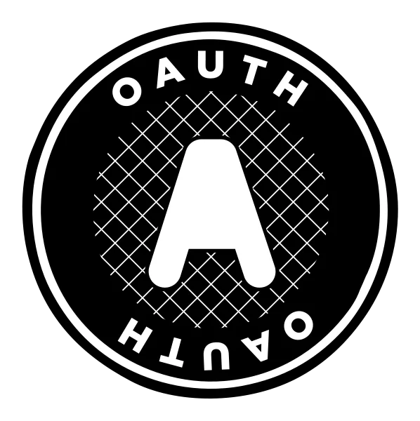

Hola a todos!

Voy a hacer una serie de post sobre oAuth2, intentando aclarar cada concepto paso a paso.

La idea es explicar lo mejor posible todos los conceptos (al menos los más importantes) para que se entienda lo mejor posible, es un tema bastante complejo pero también muy importante y en lo personal creo que todo desarrollador debería comprenderlo bien.

También veremos **OpenID Connect** como parte de esta serie ya que están muy relacionados.

A fines prácticos vamos a hablar siempre de **oAuth2**.

# ¿Qué es oAuth2?

Es un protocolo standard, de autorización, así que vamos a dedicar este primer post a aclarar esto: ¿Qué es oAuth?

## Autorización vs autenticación

> Autorizado es que tiene permisos para hacer algo.

> Autenticado es que se puede verificar quién es.

Como vemos no es lo mismo, de hecho son cosas separadas.

### Estar autorizado

El ejemplo más claro para mí es un ticket de cine, el mismo no tiene nombre, ni dice nada sobre la persona que lo compró, pero **autoriza** a quien lo tenga a hacer algo, en este caso a entrar a ver una película, y solo lo autoriza a hacer eso.
Es importante tener en cuenta que no importa si yo compré el ticket, quien lo tenga podrá entrar al cine aunque lo haya encontrado en el suelo.

Podemos tener autorizaciones que nos permitan hacer más cosas, pero si hablamos de autorización el simple hecho de poseer el ticket (vamos a llamarlo **Token**) nos habilita a hacer algo independientemente de nuestra identidad, y de hecho, quien nos autorice no necesita saber nada sobre nosotros, solo que tenemos ese Token (en este caso en forma de un ticket de cine)

### Estar autenticado

En este caso la **autenticación** verifica que somos quienes decimos ser, pero no implica que estemos autorizados.
Un ejemplo puede ser un documento, permite verificar datos propios pero no implica que tenga permisos de hacer algo, por ejemplo, pasar una frontera, o volviendo al ejemplo anterior ingresar al cine, si no tengo un ticket no puedo entrar al cine.

### Se pueden mezclar autorización y autenticación

Es posible que en algunos casos el hecho de verificar nuestra identidad nos de acceso, porque **en el mundo real los conceptos son menos claros**, pero para hablar de oAuth y OIDC (OpenID Connect) vamos a diferenciarlos, ya que 

> oAuth es un protocolo de autorización

> OIDC es un protocolo de autenticación

### Algunas aclaraciones

Por simplificar, a veces se llama OIDC cuando tenemos ambas cosas, oAuth y OIDC porque este último **es una extensión del primero**, pero siendo rigurosos OIDC provee una capa de autenticación a oAuth que es un protocolo de autenticación.

## ¿Qué problema intenta solucionar?

Sin entrar en historias largas, el problema que intentams solucionar es:

> Autorizar a un cliente, sin exponer credenciales ni identidad, dando un acceso limitado a solo un conjunto de recursos por un tiempo.

Un ejemplo puede ser cuando hacemos login con Twitter (o Facebook, etc.) para poder usar otra aplicación, por ejemplo Adobe.
Estamos dando acceso a parte de nuestros datos a un cliente (el sitio de Adobe)

Vamos a ver un poco de vocabulario

### ¿Quién es un cliente?
Un cliente será cualquier aplicación que quiera tener acceso a un recuso. Nunca será una persona física.
Algunos ejemplos:
 - Un sitio web
 - Un frontend que quiere acceder a una API
 - Un backend que accede a otro backend

### ¿Qué son recursos?
 Llamamos recursos a todo aquello a lo que podemos dar un nivel de acceso:
  - Una aplicación
  - Una parte de la aplicación
  - Una API
  - Un sistema
  - Un conjunto de información
  - Etc.

### ¿Y quién se encarga de dar acceso a los clientes sobre esos recursos?
Esta entidad se llama **Identity provider o IDP** (por ejemplo Facebook), es quien conoce a los usuarios y otorga permisos a los clientes (el sitio de Adobe) a acceder a mi información (el recurso).
En Instagam podemos tener la opción de que una publicación se vea también en Twitter, esto es un buen ejemplo de oAuth.

## Algunos ejemplos de uso de oAuth
Instagram quiere publicar en Twitter en nuestro nombre, bien, entonces:
 - Instagram es el cliente
 - La API de Twitter es el recurso
 - Twitter es también el IDP (porque somos usuarios de Twitter)

Entonces, Twitter nos conoce como usuarios y también a Instagram como cliente, y simplemente le da acceso a la API de publicación en nuestro nombre por un tiempo limitado a través de un Token. De este modo solucionamos muchos problemas.

 Lo mismo pasa cuando queremos importar contactos de una red social a otra, al final, **concentimos** acceso a un recurso que es nuestro (nuestros contactos, nuestro timeline, es así que nuestro rol es de **Resource owner**) a un cliente (Instagram o quién sea)

### Identity provider
El IDP puede no ser quien gestione los recusos, solo quien gestiona los accesos, por ejemplo en Google tenemos un único login (IDP) con el cual accedemos a muchos servicios (Recursos) que no están en el mismo dominio (y de hecho, no son la misma aplicación ni nada)

> Nota: es por eso que en 2021 hubo un fallo global en los servicios de Google porque falló el servicio de autenticación (IDP) que todos los otros servicios usan.

## Repasando el vocabulario
 - Recurso: Un elemento al que se puede otorgar acceso, como una API, un dato, una aplicación, etc.
 - Token: Un elemento que sirve para otorgar el acceso, en forma de un conjunto de caracteres (un GUID, un número, o algo más complejo como un JSON Web Token), suelen tener un acceso limitado a ciertos recursos por un tiempo limitado.
 - IDP: Es quien otorga Tokens, quien conoce a los usuarios y a los clientes.
 - Cliente: Una aplicación que quiere acceder a un recurso.
 - Resource Owner: El propietario de los recursos, no siempre son personas, en el caso de que el recurso sea una API el RO será la aplicación.

 Bien, en la próxima continuamos hablando sobre flujos de autenticación. Nos leemos.

