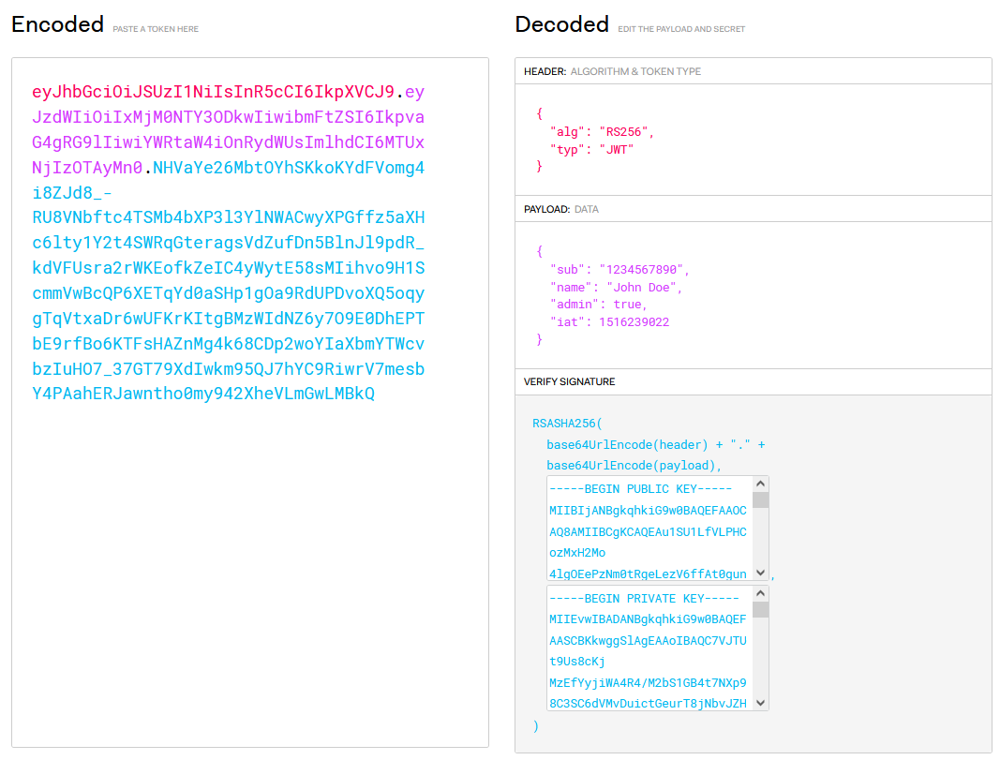

[En el post anterior](2021-12-01-oauth-1.md) dijimos que oAuth provee un token para dar acceso a un grupo limitado de recursos durante un tiempo. En este post vamos a hablar un poco sobre los Token, más específicamente del [JSON Web Token](https://datatracker.ietf.org/doc/html/rfc7519) (JWT) y algunas particulariades que es interesante conocer.

# ¿Qué es un Token?

Es un trozo de información que representa algo, una definición que no dice nada. Por ejemplo, un GUID puede ser un token, un conjunto de 4 números también. Al final cualquier trozo de datos que tenga un sentido en mi sistema para representar algo será un token.

> Sin embargo es este post vamos a hablar siempre de JWT (JSON Web Token) que es lo que utiliza oAuth, también voy a simplificar algunos conceptos y detalles y centrarme en lo más común.

# ¿Qué es JSON Web Token (JWT)?

Es un JSON, con información variada, lo prinicipal 
 - Una cabecera
 - El contenido
 - Una firma

> Ejempo tomado de [JWT.io](https://jwt.io)

## Cabecera del JWT
Acá nos encontramos con información sobre el contenido, en su modo más simple nos dirá al algorítmo con el que se generó la firma (el bloque final)

## Contenido (Payload)
La información en sí

## Firma
Esta parte permite verificar que el contenido del JWT no ha sido alterado, ¿de qué modo? mayormente se calcula un hash del contenido y esa hash se firma con una clave asimétrica.
En pocas palabras: 
 - El IDP tiene un certificado con una clave privada y una pública en su poder
 - Calcula el hash del contenido
 - Firma digitalmente son su clave privada el hash
 - Quienes quieran verificar que un JWT no ha sido alterado verifican esa firma utilizando la clave pública (más adelante veremos cómo se obtiene)

 De este modo se valida que el contenido del JWT (que es visible) no ha sido alterado y fue firmado utilizando la clave privada del IDP
 > Para más información sobre firma asimétrica [dejo este link que profundiza sobre el tema](https://en.wikipedia.org/wiki/Digital_signature)

 > Existe la posiblidad de usar otros algorítmos que no son asimétricos, en esos casos se deben compartir las claves de manera privada

# Access Token en oAuth
Finalmente oAuth nos va a entregar un access token para poder obtener acceso (autorización) a un recurso, esto es lo que debemos comprender.
Este token tendrá información sobre el recurso (más precisamente sobre un "scope"), un vencimiento y una firma.

## ¿Qué nos permite hacer?
Como dijimos anteriormente, un access token me otorga acceso, mejor dicho, otorga acceso a quien sea que lo tenga (nuevamente, la compración con un ticken de cine, no importa quién lo obtuvo, solo se valida que quien quiera ingresar a la función tenga un ticket válido)

# ¿Cómo sabe el Resource provider que un token es válido?
El token tiene varios datos para comprobar su validés:
 - Que el recurso (scope) que figura en el token sea el correcto, es decir, que estemos intentanto usar el token para lo que fue creado
 - Que su fecha de expiración no haya pasado
 - Que haya sido otorgado por un IDP de confianza

 ## Recursos y scopes
 Hasta ahora hablamos de recursos, pero en realidad los token se otorgan para acceder a scopes, que son uno o más recursos. Por ejemplo: puedo definir en mi API un scope que sea "users_read" y que esto signifique que se puede acceder en modo lectura a varios endpoints de mi API. O simplemente crear un scope "API" que implique acceder a cualquier endpoint de la API.
 Podemos otorgar un token con acceso a múltiples scopes, por ejemplo "user_info" y "API1"
 > Es importante señalar que existen ciertos scopes definidos por el protocolo y por OIDC

 ### Scopes definidos dentro de oAuth
 Existen 

 ## Fecha de validéz
Dentro del token tendremos dos fechas, una fecha desde y otra hasta, que que se pueden otorgar token a futuro.
La fechas suelen expresarse en EPOC

> Es común que se cuente con un tiempo de gracia una vez vencido el token, para compenzar tiempos de transferencia, etc. puede llamarse _clock skew_

 ## IDP de confianza
Cómo sabe el resource provider que el token que está recibiendo fue creado por un IDP de confianza?

endpoints

 Bien, en la próxima continuamos hablando sobre Tokens. Nos leemos.

