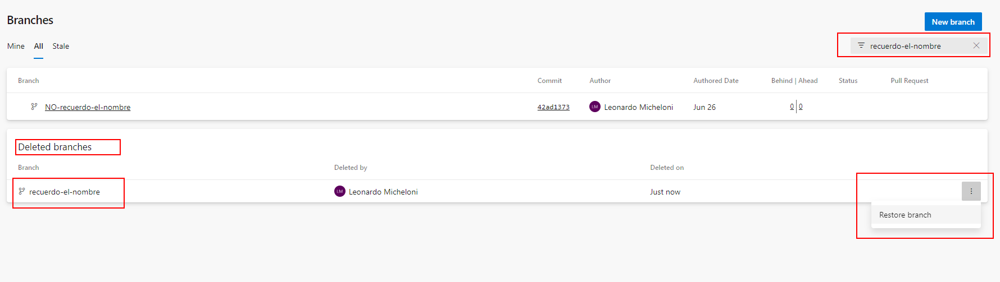

# Introducción

En el post anterior vimos cómo recuperar un repositorio Git que ha sido borrado en Azure Devops. En este caso vamos a ver cómo recuperar un branch que ha sido borrado.

## El método fácil

Existe ya un método dentro del portal de Azure DevOps para recuperar un branch borrado. Para ello, vamos a la pestaña Repos y seleccionamos el repositorio donde estaba el branch.
Si recordamos el nombre del branch borrado solo tenemos que buscar el branch del siguiente modo:



Buscamos el branch por nombre y vemos que aparece debajo en la lista de branches borrados, haciendo click en los puntos de la derecha podemos restaurarlo mediante la opción Restore.
Y voilá, ya tenemos nuestro branch de vuelta.

## No sabemos el nombre del branch que fue borrado

En el caso que no recordemos exactamente el nombre no podemos buscarlo, pero podemos mediante git obtener el listado de branches borrados y restaurar el que queramos.

> Disclaimer: Este método solo funciona si hicimos checkout del branch en el repo que queremos recuperar el nombre.

Para ello, vamos a nuestro repositorio local y ejecutamos el siguiente comando:

```bash

git reflog

```

Esto nos va a mostrar el listado de commits que hemos hecho en nuestro repositorio local, incluyendo los que hemos hecho en branches que ya no existen.

Con esto vamos a Azure DevOps y buscamos el branch por nombre y lo veremos para recuperarlo igual que en el método anterior.

Enjoy.