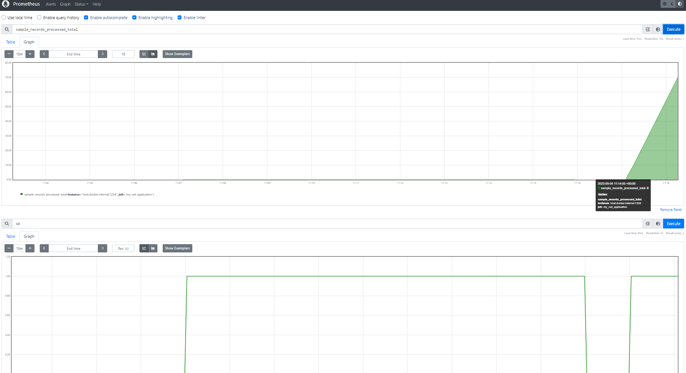

# Introducción

Prometheus es un sistema de monitoreo de código abierto que nos permite almacenar series de tiempo de datos numéricos. Es muy utilizado para monitorear aplicaciones y servicios en producción.
En este caso vamos a ver cómo enviar datos desde una aplicación .NET a Prometheus.

## Agregar el paquete NuGet

Utilizaremos https://github.com/prometheus-net/prometheus-net en nuestra aplicación .NET.

Y agregaremos el siguiete código
    
``` csharp
    internal class Program
    {
        static void Main(string[] args)
        {

            using var server = new KestrelMetricServer(port: 1234);
            server.Start();

            // Generate some sample data from fake business logic.
            var recordsProcessed = Metrics.CreateCounter("sample_records_processed_total", "Total number of records processed.");


            _ = Task.Run(async delegate
            {
                while (true)
                {
                    // Pretend to process a record approximately every second, just for changing sample data.
                    recordsProcessed.Inc();

                    await Task.Delay(TimeSpan.FromSeconds(1));
                }
            });

            Console.WriteLine("Listening on port 1234");
            Console.ReadLine();
        }
    }
```

Con este tenemos por un lado las métricas por defecto que nos da Prometheus y por otro lado una métrica que nosotros creamos llamada `sample_records_processed_total` que es un contador que incrementa cada segundo.


## Configurar Prometheus para que lea nuestros datos

``` yaml

global:
  scrape_interval: 5s
  evaluation_interval: 5s

scrape_configs:
- job_name: 'my_net_application'
  static_configs:
  - targets: ['host.docker.internal:1234']

```

Llamaremos a este archivo `prometheus.yml` y se copiará en la carpeta donde Prometheus busca su configuración.


## Ejecutar Prometheus desde Docker

``` yaml
version: "3.7"
services:
  prometheus:
    image: prom/prometheus
    container_name: prometheus
    volumes:
      - ./prometheus.yml:/etc/prometheus/prometheus.yml
    command:
      - '--config.file=/etc/prometheus/prometheus.yml'
    ports:
      - 9090:9090
    restart: always
```

En el comando `command` le indicamos a Prometheus que lea la configuración desde el archivo `prometheus.yml` que montamos en el volumen, éste es el archivo que creamos en el paso anterior.

## Ejecutar nuestra aplicación .NET

Ejecutamos la aplicación y vemos que Prometheus está leyendo los datos que enviamos desde nuestra aplicación.




Dejo el código de ejemplo por acá https://github.com/leomicheloni/prometheus-net-sample


Enjoy.