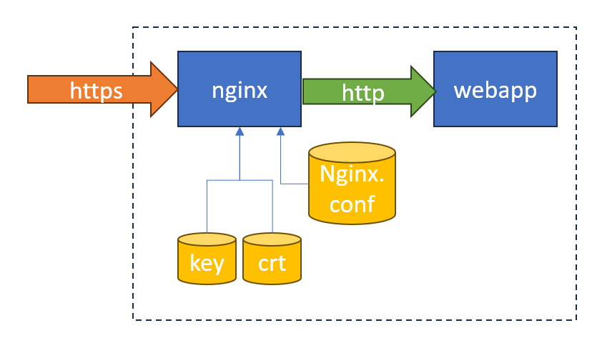

## "Introducción"

Cuando queremos probar algo en local (una aplicación web), dentro de un contenedor, no podemos utilizar https como desde Visual Studio o IIS.
Si necesitamos sí o sí https, debemos configurar algunas cosas, como por ejemplo, un certificado autofirmado, nginx, etc.
En este post vamos a detaler cómo hacerlo.



## Pasos

Vamos a necesitar hacer un par de cosas, voy a detallar los pasos a seguir en una PC con Windows y una aplicación .NET Core, es que lo que yo uso.

Básicamente pondremos nuestra aplicación en un contenedor, configuraremos nginx para que haga de proxy y que además tenga https. Luego un docker compose que levante todo.

## Crear certificado autofirmado

Para crear certificados autofirmados, podemos utilizar openssl. En Windows, podemos instalarlo desde [aquí](https://slproweb.com/products/Win32OpenSSL.html).

y ejecutar este comando:

**localhost.conf**

``` txt
[req]
default_bits       = 2048
default_keyfile    = localhost.key
distinguished_name = req_distinguished_name
req_extensions     = req_ext
x509_extensions    = v3_ca

[req_distinguished_name]
countryName                 = Country Name (2 letter code)
countryName_default         = US
stateOrProvinceName         = State or Province Name (full name)
stateOrProvinceName_default = Texas
localityName                = Locality Name (eg, city)
localityName_default        = Dallas
organizationName            = Organization Name (eg, company)
organizationName_default    = localhost
organizationalUnitName      = organizationalunit
organizationalUnitName_default = Development
commonName                  = Common Name (e.g. server FQDN or YOUR name)
commonName_default          = localhost
commonName_max              = 64

[req_ext]
subjectAltName = @alt_names

[v3_ca]
subjectAltName = @alt_names

[alt_names]
DNS.1   = localhost
DNS.2   = 127.0.0.1
```

``` powershell
openssl req -x509 -nodes -days 365 -newkey rsa:2048 -keyout localhost.key -out localhost.crt -config localhost.conf -passin pass:12345678
```
Esto creará dos archivos, localhost.crt y localhost.key, estos archivos los usuaremos en nginx.

Ahora necesitamos registrar el certificado como confiable ya que es auto-firmado. (es decir, registrar en Windows como confiable)

En el Administrador de Certificados (certmgr.msc), puedes encontrar esta ubicación siguiendo estos pasos:

Abrimos el Administrador de Certificados. 
- Para esto escribimos certmgr.msc en el diálogo Ejecutar (Win + R). 
- En el Administrador de Certificados, expande el árbol de Certificados "Usuario Actual" en el panel izquierdo.
- Debajo de esto, expande la carpeta Autoridades de Certificación Raíz Confiables. 

Hacemos clic en la carpeta Certificados bajo Autoridades de Certificación Raíz Confiables. 

Esta es la ubicación equivalente a Cert:\CurrentUser\Root en PowerShell. 

Luego

En el Administrador de Certificados (certlm.msc, Certificate Manager for local machine), puedes encontrar esta ubicación siguiendo estos pasos:

- Abre el Administrador de Certificados para la Máquina Local. Puedes hacer esto escribiendo certlm.msc en el diálogo Ejecutar (Win + R).
- En el Administrador de Certificados, expande el árbol Certificados (Computadora Local) en el panel izquierdo.
- Debajo de esto, expande la carpeta Personal.
- Haz clic en la carpeta Certificados bajo Personal.

Ahora nginx usará los archivos de certificado y clave para servir https. Y deberías estar bien.

## Configurar nginx

Para esto simplemente vamos a crear un archivo de configuración para nginx, que será el siguiente:

**nginx.conf**

``` nginx
worker_processes 1;

events { worker_connections 1024; }

http {

    sendfile on;

    upstream web-api {
        server api:80;
    }

    server {
        listen 80;
        server_name localhost;

        location / {
            return 301 https://$host$request_uri;
        }
    }

    server {
        listen 443 ssl;
        server_name localhost;

        ssl_certificate /etc/ssl/certs/localhost.crt;
        ssl_certificate_key /etc/ssl/private/localhost.key;

        location / {
            proxy_pass         http://web-api;
            proxy_redirect     off;
            proxy_http_version 1.1;
            proxy_cache_bypass $http_upgrade;
            proxy_set_header   Upgrade $http_upgrade;
            proxy_set_header   Connection keep-alive;
            proxy_set_header   Host $host;
            proxy_set_header   X-Real-IP $remote_addr;
            proxy_set_header   X-Forwarded-For $proxy_add_x_forwarded_for;
            proxy_set_header   X-Forwarded-Proto $scheme;
            proxy_set_header   X-Forwarded-Host $server_name;
        }
    }
}
```

Le decimos a nginx que utilice el certificado y la clave que creamos antes, y que escuche en el puerto 443.
y con el proxy_pass le decimos que redirija las peticiones al servicio que escucha en el puerto 80. (más adelante ese será el nombre del servicio en el docker compose)

Ahora creamos el Dockerfile para nginx:

``` dockerfile
FROM nginx:alpine

COPY ./nginx.conf /etc/nginx/nginx.conf
COPY localhost.crt /etc/ssl/certs/localhost.crt
COPY localhost.key /etc/ssl/private/localhost.key

CMD ["nginx", "-g", "daemon off;"]
```
Básicamente copiamos el archivo de configuración y los archivos de certificado y clave al contenedor.

## Configurar nuestra app
En este caso una simple aplicación .NET Core, que escucha en el puerto 80.

``` dockerfile
FROM mcr.microsoft.com/dotnet/sdk:8.0 AS build
WORKDIR /app

COPY *.csproj ./
RUN dotnet restore

COPY . ./
RUN dotnet publish -c Release -o out

FROM mcr.microsoft.com/dotnet/aspnet:8.0 AS runtime
WORKDIR /app

ENV ASPNETCORE_HTTP_PORTS 80

EXPOSE 80
EXPOSE 443

COPY --from=build /app/out ./

CMD ["dotnet", "app.dll"]
```

## Docker compose

``` yaml
version: "3.7"

services:

reverseproxy:
    build:
      context: ./nginx
      dockerfile: Dockerfile.nginx
    ports:
      - "8080:80"
      - "1443:443"
    restart: always

api:
    depends_on:
      - reverseproxy
    build:
      context: .
      dockerfile: Dockerfile
    ports:
      - "8088:80"
    restart: always
```

Simplemente apuntamos los dos servicios a sus Dockerfiles, y abrimos el puerto 1443 para https.


Si vemos algún error en el navegador relacionado con https lo más probable es que no hayamos registrado el certificado como confiable.

[Dejo por acá un repositorio con el código](https://github.com/leomicheloni/nginx-https-docker-netcore)

Nos leemos.


